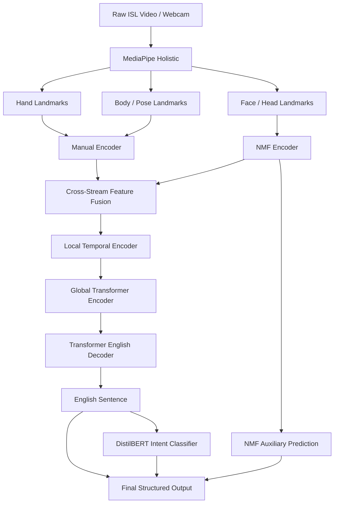
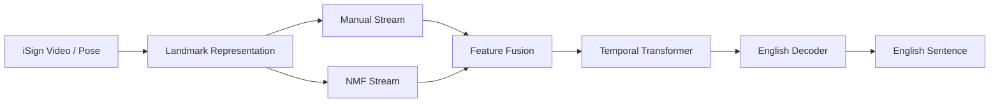
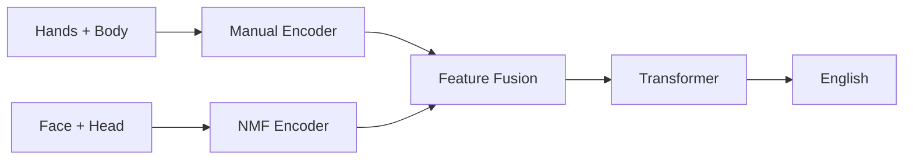

# RSLIT

### Lightweight Landmark-Based Indian Sign Language → English Translation

A research-oriented Indian Sign Language (ISL) translation system using **hand, body-pose, and non-manual facial/head landmarks** with a focus on **continuous translation, signer-independent generalization, and efficient inference**.

---

## Proposed Architecture



---

## Research Objective

The system takes an **ISL video or webcam stream** as input and converts it into structured landmark sequences using MediaPipe.

The proposed model separates the information into **manual** and **non-manual** streams before using a Transformer-based architecture to generate an English sentence.

### Main Research Question

> Can explicit modeling and fusion of manual and non-manual landmark streams improve continuous ISL-to-English translation and signer-independent generalization compared with pose-only baselines, while maintaining a lightweight computational footprint?

---

## Core Idea

The system accepts **raw video/webcam input**, but the trained translation model operates on structured landmarks rather than raw RGB pixels.

```text
Raw video
   ↓
MediaPipe
   ↓
Hand + body + face/head landmarks
   ↓
Manual / NMF feature streams
   ↓
Transformer-based translation
   ↓
English sentence
```

---

## Research Gaps Targeted

### 1. Explicit Non-Manual Feature Modeling

Recent systems can already use face/body keypoints, so the claim is **not** that facial information has never been used.

Our target is the explicit modeling of **linguistically meaningful non-manual features (NMFs)** as a dedicated branch, followed by controlled ablation and, where labels are available, auxiliary supervision.

---

### 2. Signer-Independent Generalization

We will explicitly compare standard evaluation with **unseen-signer evaluation**.

```text
Standard split
      vs
Signer-independent split
```

This tests whether the model generalizes beyond the people seen during training.

---

### 3. Local + Global Temporal Modeling

Sign language contains both short, fine-grained movements and longer sentence-level context.

The proposed model therefore uses:

```text
Landmark sequence
      ↓
Local Temporal Encoder
      ↓
Global Transformer
      ↓
English Decoder
```

---

### 4. Translation Quality

Continuous ISL-to-English translation remains challenging. The objective is to improve translation through better representation and temporal/linguistic modeling rather than simply using a larger video model.

---

### 5. Efficiency

Because the model uses landmarks instead of raw RGB features, we can evaluate the trade-off between:

- translation quality
- parameter count
- latency
- FPS
- memory

---

## Dataset Strategy

### INCLUDE-50 — Baseline

Used for isolated-sign recognition.

| Property | Value |
|---|---:|
| Classes | 50 |
| Training | 689 |
| Validation | 77 |
| Test | 192 |
| Total | 958 |

### Baseline Pipeline


The BiLSTM is a **baseline**, not the main proposed contribution.

---

### iSign — Main Translation Dataset

Used for continuous ISL-to-English translation.



---

## Landmark Representation

Current baseline:

```text
Left hand:    21 × 3 = 63
Right hand:   21 × 3 = 63
Body pose:    33 × 3 = 99
--------------------------------
Total:                  225 features/frame
```

A video with `T` frames becomes:

```text
(T, 225)
```

The face/head representation will be designed separately for the NMF branch instead of adding the entire face mesh directly to the baseline vector.

---

## Model Components

### Baseline

**BiLSTM**

Used for isolated sign recognition on INCLUDE-50.

### Proposed Model

**Transformer Encoder–Decoder**

- Manual encoder: hand + body/pose features
- NMF encoder: face + head features
- Cross-stream feature fusion
- Local temporal encoder
- Global Transformer encoder
- English Transformer decoder

### Optional Auxiliary Branch

**NMF prediction head**

Used when reliable non-manual labels are available.

### Downstream

**DistilBERT**

Used for intent classification from translated English.

---

## Experimental Plan

### Experiment 1 — Isolated Baseline

```text
Hands + Body → BiLSTM
```

Metrics:

- Accuracy
- Macro-F1
- Precision
- Recall
- Confusion Matrix

---

### Experiment 2 — Pose Transformer Baseline

```text
Hands + Body → Transformer → English
```

---

### Experiment 3 — Face/Head Augmentation

```text
Hands + Body + Face/Head → Transformer
```

Research question:

> Does adding non-manual information improve translation?

---

### Experiment 4 — Dedicated NMF Branch



Research question:

> Does explicitly separating manual and non-manual information work better than simply concatenating all landmarks?

---

### Experiment 5 — NMF Auxiliary Supervision

Add an auxiliary objective for non-manual linguistic cues when reliable labels are available.

Research question:

> Does explicit supervision of non-manual information help the translation model learn a more useful representation?

---

### Experiment 6 — Local + Global Temporal Modeling

Compare:

```text
Standard Transformer
vs
Local Temporal Encoder + Global Transformer
```

Research question:

> Does explicitly modeling short-term signing motion improve long-range sentence translation?

---

### Experiment 7 — Signer-Independent Evaluation

Evaluate the strongest models on previously unseen signers.

---

### Experiment 8 — Efficiency

Measure:

- Model size
- Parameter count
- Memory
- Latency
- FPS
- BLEU
- chrF
- WER

---

## Intended Contribution

1. A lightweight landmark-based continuous ISL-to-English architecture with explicit manual/non-manual feature separation.
2. A controlled study of whether non-manual cues improve translation.
3. Signer-independent evaluation of the proposed approach.
4. Accuracy-versus-efficiency analysis for practical deployment.

### Proposed Contribution Statement

> We propose a lightweight landmark-based framework for continuous Indian Sign Language-to-English translation that explicitly models manual and non-manual linguistic cues, fuses them through a temporal Transformer architecture, and evaluates the resulting system under signer-independent and efficiency-constrained conditions.

---

## Implementation Roadmap

```text
Phase 1
INCLUDE → MediaPipe → BiLSTM Baseline

        ↓

Phase 2
iSign Pose → Transformer Baseline

        ↓

Phase 3
Add Face / Head Stream

        ↓

Phase 4
Dedicated NMF Encoder
+ Auxiliary Objective

        ↓

Phase 5
Local + Global Temporal Modeling

        ↓

Phase 6
Signer-Independent Evaluation

        ↓

Phase 7
Efficiency Optimization

        ↓

Phase 8
FastAPI + Streamlit Deployment
```

---

## Technology Stack

| Component | Technology |
|---|---|
| Programming | Python |
| Video Processing | OpenCV |
| Landmark Extraction | MediaPipe |
| Numerical Processing | NumPy |
| Data Processing | Pandas |
| Deep Learning | PyTorch |
| NLP | Hugging Face Transformers |
| Evaluation | scikit-learn |
| Backend | FastAPI |
| Frontend | Streamlit |

---

## Project Structure

```text
ISLR/
│
├── src/
│   ├── preprocessing/
│   │   ├── test_mediapipe.py
│   │   ├── normalize_landmarks.py
│   │   ├── record_dataset.py
│   │   ├── create_include_manifest.py
│   │   ├── verify_include.py
│   │   ├── download_include.py
│   │   └── preprocess_include.py
│   │
│   ├── models/
│   ├── training/
│   ├── evaluation/
│   └── app/
│
├── data/
│   ├── include/
│   │   └── metadata/
│   │       └── include50_manifest.csv
│   │
│   └── landmarks/
│
├── models/
│
├── notebooks/
│
├── requirements.txt
└── README.md
```

Large INCLUDE video data is stored separately on the local D: drive.

---

## Current Progress

- [x] Python environment
- [x] MediaPipe setup
- [x] Webcam landmark extraction
- [x] 225-feature representation
- [x] Landmark normalization
- [x] Custom recording pipeline
- [x] INCLUDE-50 metadata
- [x] INCLUDE-50 manifest
- [x] 958/958 videos verified
- [x] INCLUDE videos downloaded and extracted
- [ ] INCLUDE → MediaPipe preprocessing
- [ ] BiLSTM baseline
- [ ] iSign Transformer baseline
- [ ] Manual/NMF fusion model
- [ ] Signer-independent evaluation
- [ ] Efficiency evaluation
- [ ] FastAPI + Streamlit deployment

---

## Terminology

### Landmark

A coordinate representing a detected point on the hand, body, face, or head.

### Landmark-Based / Pose-Based

The model receives structured coordinates rather than raw RGB pixels.

### Gloss

A textual label used to represent a sign in an annotated dataset.

### Temporal Encoder

A neural component that learns how landmark positions change over time.

### Transformer Encoder

Processes the input sequence and creates contextual representations.

### Transformer Decoder

Generates the English sentence token by token.

### NMF

**Non-Manual Features** such as facial and head movements that can carry linguistic information.

---

## Research Positioning

The project does **not** claim that pose-based ISL translation itself is novel.

The intended novelty is the combination of:

```text
Manual landmark stream
        +
Dedicated non-manual stream
        +
Local-to-global temporal modeling
        +
Signer-independent evaluation
        +
Efficiency analysis
```

This positions the work as an experimentally testable extension of existing pose-based ISL translation rather than a simple reproduction.

---

## Proposed Contribution

> We propose a lightweight landmark-based framework for continuous Indian Sign Language-to-English translation that explicitly models manual and non-manual linguistic cues, fuses them through a temporal Transformer architecture, and evaluates the resulting system under signer-independent and efficiency-constrained conditions.

---

## Roadmap

```text
INCLUDE → MediaPipe → BiLSTM Baseline
                    ↓
iSign Pose → Transformer Baseline
                    ↓
Add Face / Head Stream
                    ↓
Dedicated NMF Encoder
                    ↓
Local + Global Temporal Modeling
                    ↓
Signer-Independent Evaluation
                    ↓
Efficiency Optimization
                    ↓
Deployment
```

---

## Key References

- **iSign: A Benchmark for Indian Sign Language Processing**
- **PoseStitch-SLT: Linguistically Inspired Pose-Stitching for End-to-End Sign Language Translation**
- **Enhancing Indian Sign Language Translation via Motion-Aware Modeling**
- **Multilingual Sign Language Translation with Unified Datasets and Pose-Based Transformers**
- **Pose-Based Temporal Convolutional Networks for Isolated Indian Sign Language Word Recognition**
- **ISH-NEWS: End-to-End Sentence-Level Indian Sign Language Translation**